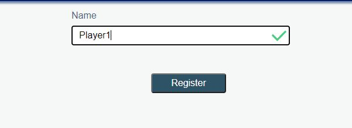
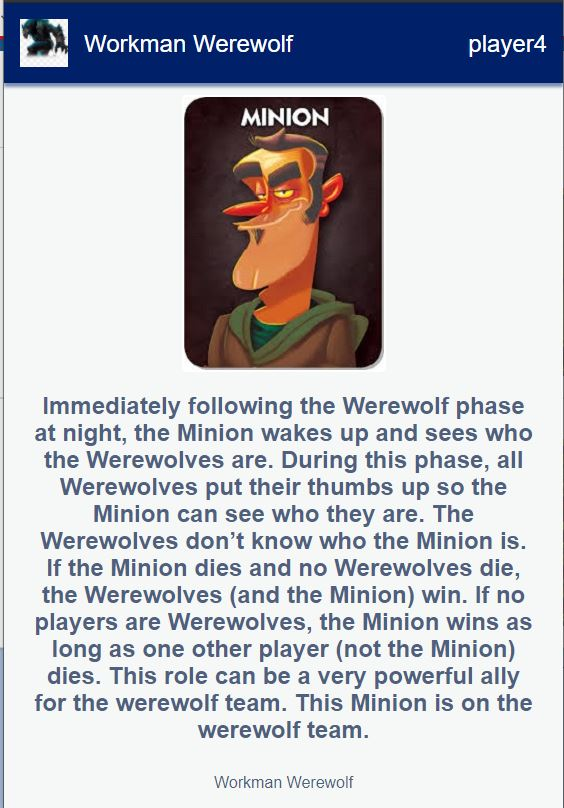
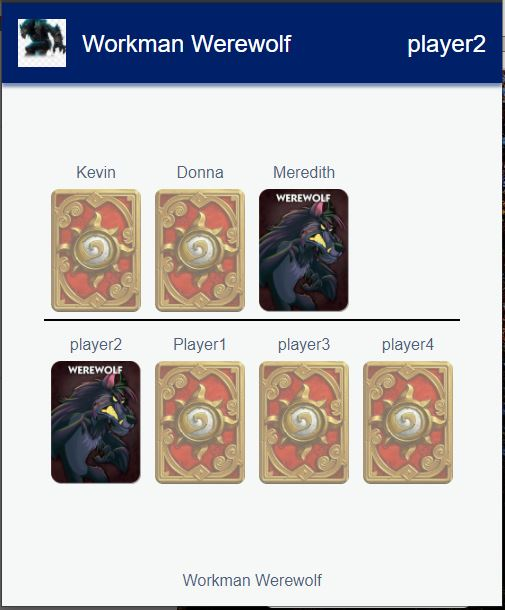

# One Night Werewolf built with LWC

This is a game based on One Night Werewolf that was built to play remotely with family and friends.

The game is made up of two LWC apps, this is the second, which is the player app.

The host app can be found [here](https://github.com/workmanDX/werewolf-host).

I started with the original source code found [here](https://github.com/fostive/quiz-host-app) and modified it.

# A view of player registering

# A view of the player looking at their card

# A view of the player taking their turn

